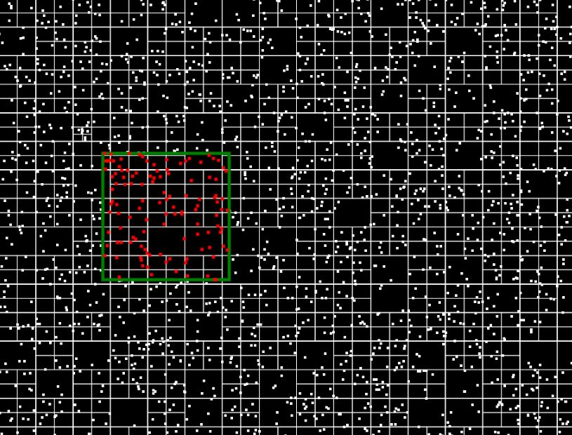
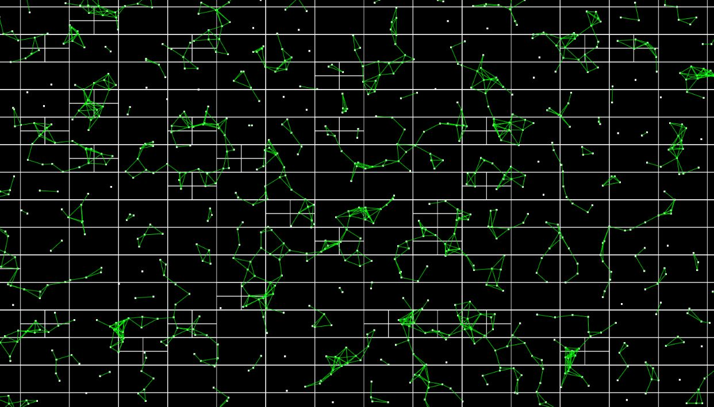

# Exercitando Quadtree em JavaScript

Este repositório contém um projeto de exercício em JavaScript onde estou explorando o conceito de **Quadtree** para detecção de colisões e proximidade entre objetos.

## Quadtree - O que é?

Quadtree é uma estrutura de dados em árvore utilizada para dividir um espaço bidimensional em quadrantes menores. É especialmente útil para otimizar a busca e detecção de objetos dentro de uma área, como em jogos, simulações físicas ou sistemas de detecção de colisão.

## Objetivo do Projeto

O objetivo deste projeto é aprender e implementar o conceito de Quadtree em JavaScript para detecção de colisões e proximidade entre objetos em um cenário bidimensional. Isso pode ser aplicado em diversos contextos, desde jogos até aplicações gráficas e simulações.

## Demonstração

Aqui estão duas imagens ilustrativas do projeto:

### 1. Detectando Colisões (img1.JPG)

Nesta imagem, podemos visualizar como a estrutura de Quadtree é utilizada para detectar colisões entre objetos no cenário.

### 2. Detectando Proximidade (img2.JPG)

Na imagem acima, podemos observar como a Quadtree é empregada para identificar a proximidade entre objetos, possibilitando uma otimização no processamento de cálculos.

## Como executar o projeto

Para executar o projeto localmente, basta clonar este repositório e abrir o arquivo `index.html` em um navegador compatível com JavaScript.

